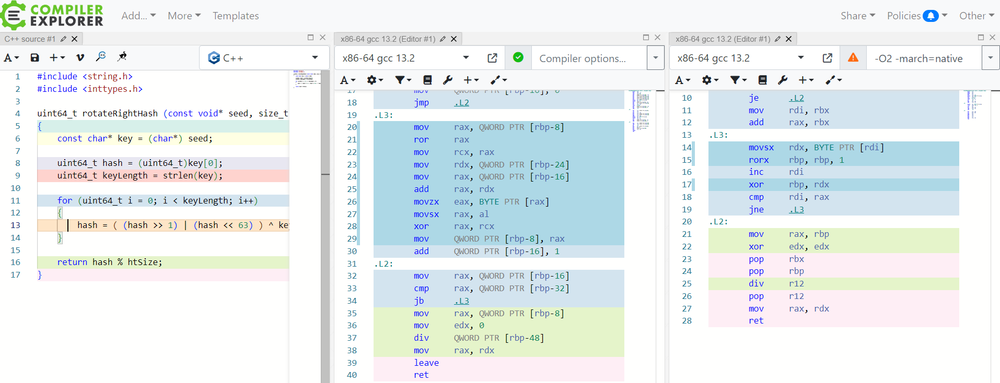

# Hash Table investigation

## Introduction

This project is dedicated to investigating the Hash Table data structure.

## Objectives

The goals of this project are:

0. To implement a simple Hash Table using cache-friendly doubly linked list for handling collisions.

1. To test and compare different hash functions under certain conditions and choose the best one.

2. To determine hotspots, analyze them and optimize using:

    * Inline assembly
    * Intrinsics
    * Seperate assembly file

# Part 1. Hash function comparison

Let's firstly mark down all of the hash functions:

1. [Zero hash](#zero-hash)
2. [First letter ASCII hash](#first-letter-ascii-hash)
3. [Word length hash](#word-length-hash)
4. [ASCII sum divided by length hash](#ascii-sum-divided-by-length-hash)
5. [ASCII sum hash](#ascii-sum-hash)
6. [ROR hash](#ror-hash)
7. [ROL hash](#rol-hash)
8. [FNV hash](#fnv-hash)

> Further on you will see histograms with collision distributions  

### Zero hash

This hash always returns 0, so it's obvious that all of the elements will be stored in 1st cell.

-imageonline.co-merged.png)

It's not so great, because the time to get the last element depends on the amount of values we insert, which is not what we are looking for.

Max. amount of collisions: $\approx$ **29000 words**

### First letter ASCII hash

The text I use (Shakespeare) as data to explore contains only lower case words, from this we can conclude that the words are distributed in cells numerated from 97 to 122.

-imageonline.co-merged.png)

Better result, but still not so good.

Max. amount of collisions: $\approx$ **2500 words**

### Word length hash

The situation here is quite similair. I've quickly made a python script to find out the longest word in the text. 
The word is honorificabilitudinitatibus and it's 27 symbols long.

-imageonline.co-merged.png)

Most of the words are less than 20 symbols long, that means that this hash is worse than the previous one.

Max. amount of collisions: $\approx$ **5000 words**

### ASCII sum divided by length hash

My thoughts are thah the division here is unnecessary. Because the ASCII sum hash has a decent distribution.

-imageonline.co-merged.png)

Max. amount of collisions: $\approx$ **4500 words**

### ASCII sum hash

From previous histograms I can conclude that the avarage length is 10. We can use this result to explain the growth of the peaks: ASCII values are around 100 and the avarage length is 10, 10 * 100 = 1000.   


Max. amount of collisions: $\approx$ **115 words**

Let's compare 2 ASCII sum hashes:

1. Hash Table Size = 101 (Prime number)

2. Load factor = 5

**1)**

.png)

**2)**

.png)

Some theory:

Load factor is calculated like this: $\alpha = \frac{N}{M}$, where N - number of keys stored, M - number of slots in our Hash Table. 

**Conclusion:** Lower load factor gives us a better distribution (as expected).

### ROR hash

simple code in C:

```
uint64_t rotateRightHash (const char* str, int length)
{
    uint64_t hash = 0;

    for (int i = 0; i < length; i++)
    {
        hash = ( (hash >> 1) | (hash << 63) ) ^ str[i]; 
    }

    return hash;    
}
```


Max. amount of collisions: $\approx$ **30 words**

Let's compare ROR hash in Godbolt using x86-64 gcc 13.2 compiler with -O0 and -O2 optimizations.



We can see that with the -O2 flag the compiler recognizes and replaces the body with the rorx instruction. You can check out more about the x86 rorx instruction [here](https://www.felixcloutier.com/x86/rorx).

### ROL hash

Same as ROR, but the shifts are inversed.


Better distribution than ROR, just because the data isn't symmetrical.

Max. amount of collisions: $\approx$ **20 words**

### FNV hash

Fowler–Noll–Vo non-cryptographic hash function. I chose it because of the simplicity it brings. For more info click [here](https://en.wikipedia.org/wiki/Fowler%E2%80%93Noll%E2%80%93Vo_hash_function).

simple code in C:

```
uint64_t FNVHash (const char* str, int length)
{
    uint64_t FNVprime = 0x811C9DC5;

    uint64_t hash = 0;

    for (uint64_t i = 0; i < keyLength; i++)
    {
        hash *= FNVprime;
        hash ^= key[i];
    }

    return hash;
}

```


Max. amount of collisions: $\approx$ **16 words**

Best result so far!

Comparison table:

| N | Hash | Table size | Expected value | Dispersion |
|:-:|:--|:-:|:-:|:-:|
| 1 | `Zero` | 5009 | 5.8 | 170854.00 |
| 2 | `First letter` | 5009 | 5.8 | 9820.45 |
| 3 | `Word length` | 5009 | 5.8 | 19997.20 |
| 4 | `ASCII sum divided by length` | 5009 | 5.8 | 19371.30 |
| 5 | `ASCII sum` | 101 | 289.7 | 19894.40
| 6 | `ASCII sum` | 5009 | 5.8 | 291.09 |
| 7 | `ROR` | 5009 | 5.8 | 27.59 |
| 8 | `ROL` | 5009 | 5.8 | 13.76 |
| 9 | `FNV` | 5009 | 5.8 | 9.73 |

# Part 2. Optimizations

## Modulo operator. Inline assembly

The modulo operator `%` is expensive because the instruction `idiv` in x86 is used and the ramainder is stored in `RDX` (for  64-bit mode). We can optimize this, but the hash table size has to be 2^n. In this case we can use bitwise `and` with a 2^n - 1 bit mask.

```
x mod 2^n <=> x & (2^n - 1)

```

Let's rewrite the code using inline assembly:

```
asm volatile 
        (
         "and %1, %0\n\t"

         : "+rm" (hash)

         : "rm" (htSize - 1)
        );
```

Using the volatile qualifier we disable compiler optimizations because we have already optimized this part and don't need changes.

Check [GCC Extended ASM](https://gcc.gnu.org/onlinedocs/gcc/Extended-Asm.html) for more.

Results:


