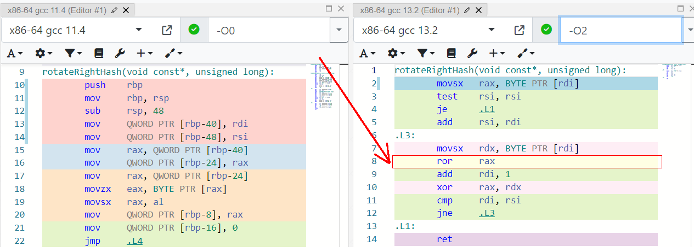
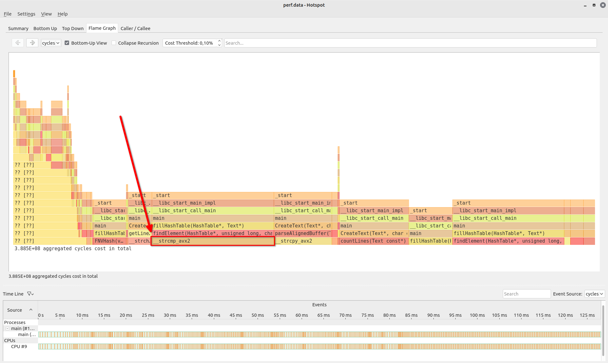

# Hash Table investigation

## Introduction

This project is dedicated to investigating the Hash Table data structure.

The goal is to find out how many times each word has been shown in a text.

By utilizing a hashtable, we can quickly track and retrieve how many times a scpecific word has appeared in a text. 

## Objectives

The goals of this project are to:

0. implement a simple Hash Table using cache-friendly doubly linked list for handling collisions. 

1. test and compare different hash functions under certain conditions and choose the best one.

2. determine hotspots, analyze them and optimize using:

    * Inline assembly
    * Intrinsics
    * Seperate assembly file

## Initial data

For benchmarks i used Shakespeares text that contains $ 30000 $ unique words, a hash table of size $ 5009 $  which is a prime number, it should be a prime in order to minimize the number of collisions and to better distribute the keys across the hash table. The mean value (load factor) is $ 5.8 $.

I'm assuming that if the mean value is low, then it won't be cache-friendly which is one of the reasons, the main question is finding a hash function that won't create any collisions. If the mean value is high, then the amount of collision will be high meaning that finding elements will be slower. **This will be researched later on**. 
 
# Part 1. Hash function comparison

Let's firstly mark down all of the hash functions:

1. [Zero hash](#zero-hash)
2. [First letter ASCII hash](#first-letter-ascii-hash)
3. [Word length hash](#word-length-hash)
4. [ASCII sum hash](#ascii-sum-hash)
5. [ASCII sum divided by length hash](#ascii-sum-divided-by-length-hash)
6. [ROR hash](#ror-hash)
7. [ROL hash](#rol-hash)
8. [FNV hash](#fnv-hash)

> The following histograms were made using python and matplotlib library.

### Zero hash

This hash always returns 0, so it's obvious that all of the elements will be stored in 1st cell.

%20.png)

It's not so great, because the time to get the last element depends on the amount of values we insert, which is not what we are looking for. 

Max. amount of collisions: $\approx$ **29000 words**

### First letter ASCII hash

The text I use (Shakespeare) as data to explore contains only lower case words, from this we can conclude that the words are distributed in cells numerated from 97 to 122.

-imageonline.co-merged.png)

Not so good.

Max. amount of collisions: $\approx$ **2500 words**

### Word length hash

The situation here is quite similair. I've quickly made a python script to find out the longest word in the text. 
The word is honorificabilitudinitatibus and it's 27 symbols long.

-imageonline.co-merged.png)

Most of the words are less than 20 symbols long, that means that this hash is worse than the previous one.

Max. amount of collisions: $\approx$ **5000 words**

### ASCII sum hash

From previous histograms I can conclude that the avarage length is 10. We can use this result to explain the growth of the peak: ASCII values are around 100 and the avarage length is 10, so it's quite understandable why we see a high collision count at 1000.   


Max. amount of collisions: $\approx$ **115 words**

### ASCII sum divided by length hash

My thoughts are thah the division here is unnecessary. Because the ASCII sum hash has a decent distribution.

-imageonline.co-merged.png)

Max. amount of collisions: $\approx$ **4500 words**

### ROR hash

simple code in C:

```
uint64_t rotateRightHash (const char* str, int length)
{
    uint64_t hash = 0;

    for (int i = 0; i < length; i++)
    {
        hash = ( (hash >> 1) | (hash << 63) ) ^ str[i]; 
    }

    return hash;    
}
```


Max. amount of collisions: $\approx$ **30 words**

Let's compare ROR hash in Godbolt using x86-64 gcc 13.2 compiler with -O0 and -O2 optimizations.



The compiler optimizes the ROL hash function by replacing the `rol()` function with a single assembly instruction `ror`.

### ROL hash

Same as ROR, but the shifts are inversed.


Better distribution than ROR, just because the data isn't symmetrical.

Max. amount of collisions: $\approx$ **20 words**

### CRC32 hash

The CRC32 Hash is a simple and fast hash function that is widely used for data integrity checks, error detection, and identification of duplicates in databases.


Max. amount of collisions: $\approx$ **15 words**

### FNV hash

Fowler–Noll–Vo non-cryptographic hash function. I chose it because of the simplicity it brings. For more info click [here](https://en.wikipedia.org/wiki/Fowler%E2%80%93Noll%E2%80%93Vo_hash_function).

simple code in C:

```
uint64_t FNVHash (const char* str, int length)
{
    uint64_t FNVprime = 0x811C9DC5;

    uint64_t hash = 0;

    for (uint64_t i = 0; i < keyLength; i++)
    {
        hash *= FNVprime;
        hash ^= key[i];
    }

    return hash;
}

```


Max. amount of collisions: $\approx$ **16 words**

Best result so far!

Comparison table:

| $ \bold{N} $  | Hash | Table size | Mean value | Dispersion |
|:--:|:------------------------------|:----:|:-----:|:---------:|
| **1**  | $Zero$                                    | $ 5009 $ | $ 5.8   $ | $ 171000 $   |
| **2**  | $Word \; length$                          | $ 5009 $ | $ 5.8   $ | $ 20000  $   |
| **3**  | $ASCII \; sum$                            | $ 101  $ | $ 289.7 $ | $ 19900  $   |
| **4**  | $ASCII \; sum \; divided \; by \; length$ | $ 5009 $ | $ 5.8   $ | $ 19400  $   |
| **5**  | $First \; letter$                         | $ 5009 $ | $ 5.8   $ | $ 9800   $   |
| **6**  | $ASCII \; sum$                            | $ 5009 $ | $ 5.8   $ | $ 290    $   |
| **7**  | $ROR$                                     | $ 5009 $ | $ 5.8   $ | $ 27     $   |
| **8**  | $ROL$                                     | $ 5009 $ | $ 5.8   $ | $ 13.7   $   |
| **9**  | $CRC32$                                   | $ 5009 $ | $ 5.8   $ | $ 9.81   $   |
| **10** | $FNV$                                     | $ 5009 $ | $ 5.8   $ | $ 9.76   $   | 

**Conclusion:** from the statistics above I can say that the FNV hash is most suitable. Also as you can see in row 3 we can see that low sized hash tables have bigger mean values, therefore bigger dispersion. Dispersion shows us how well the data is spread across the hash table that's why it's important to calculate it.  

# Part 2. Optimizations

Before we start optimizing I should say that all of the tests were run with -O2 optimization flag, we're not interested in optimizing -O0 code because that's not what people use in reality. 100 samples were used for each test. FNV hash as the hash function. The size of the hash table is 8192, why I've chosen this number you will find out in the [modulo operation](#modulo-operator-inline-assembly) part.

Baseline:

| test N      | ticks       |
|-------------|-------------|
| **1**           | $ 9.3  $ |
| **2**           | $ 9.8  $ |
| **3**           | $ 12.2 $ |
| **4**           | $ 9.7  $ |
| **5**           | $ 9.7  $ |
| $ average $ | $ 10.2 \pm  1.0 $ | 

## Strcmp function. Intrinsics

First of all we need find out which parts of code to optimize. That's why I've used `Hotspot` - a GUI for Linux `perf`. Let's have a look at the analysis.



Indeed, most of the search time is spent on comparing two words.
 
`strcmp()` is already vectorized by the authors of the C standard library. So in order to perform better we shall use the information we now about the text. The longest word in the text is `honorificabilitudinitatibus` which is 27 letters long and it fits into a `YMM` register. Now that we now that information let's align each word allocation by 32 bytes, which allows to use one `AVX2` comparison. 

Here is my optimized strcmp function:

```
int mystrcmp (const char* s1, const char* s2)
{
    __m256i s1_ = _mm256_loadu_si256((const __m256i*) s1);
    __m256i s2_ = _mm256_loadu_si256((const __m256i*) s2);

    return ~(_mm256_movemask_epi8(_mm256_cmpeq_epi8(s1_, s2_))); 
}
```

**Results:**

| test $\bold{N}$      | ticks          |
|-------------|----------------|
| **1**           | $ 7.7 $     |
| **2**           | $ 7.6 $     |
| **3**           | $ 7.6 $     |
| **4**           | $ 7.6 $     |
| **5**           | $ 7.7 $     |
| $ average $ | $7.6 \pm 0.5 $ |


### $ 1.32 $ ($ 32 \% $ better) boost compared to baseline.
 
## Modulo operator. Inline assembly

I've noticed that in the function `fillHashTable` there is one line (72) that has a longer execution time then others, let me show you:


The code:

```
    ...

  68:   for (int i = 0; i < text->numLines; i++)
        {
  70:       uint64_t listIndex = ht->hashFunction(text->lines[i].string, text->lines[i].length); 
    
  72:       listIndex %= ht->size;
    
  74:       if (findElement(ht, listIndex, text->lines[i].string) == NOT_FOUND)
            {
  76:            PushBack(&ht->lists[listIndex], text->lines[i].string);
            } 
        }

    ...
```

The modulo operator `%` is expensive because the instruction `idiv` in x86 is used and the remainder is stored in `RDX` (for  64-bit mode). We can optimize this, but the hash table size has to be 2^n. In this case we can use bitwise `and` with a 2^n - 1 bit mask.

```
x mod 2^n <=> x & (2^n - 1)
```

Let's rewrite the code using inline assembly:

<details>
  <summary>Inline assembly code</summary>

```
asm volatile 
        (
         "and %1, %0\n\t"

         : "+rm" (hash)

         : "rm" (htSize - 1)
        );
```
</details>

Using the volatile qualifier we disable compiler optimizations because we have already optimized this part and don't need changes.

Check [GCC Extended ASM](https://gcc.gnu.org/onlinedocs/gcc/Extended-Asm.html) for more.

**Results:**

| test $\bold{N}$      | ticks $ \cdot 10^9$          |
|-------------|----------------|
| **1**           | $ 7.4 $     |
| **2**           | $ 7.4 $     |
| **3**           | $ 7.6 $     |
| **4**           | $ 7.3 $     |
| **5**           | $ 7.6 $     |
| $average$ | $7.5  \pm  1.0$ |

### $ 1.02 $ ($ 2 \%$ better) boost compared to previous optimization.

## Seperate assembly file. Multiplication to addition and shifts.

I've decided to replace the multiplication with addition and shift operations.

This:

```
hash *= FNVprime;
```
Has now become this:

```
hval += (hash << 1) + (hash << 4) + (hash << 5) +
     (hash << 7) + (hash << 8) + (hash << 40);
```
But written in assembly:

<details>
  <summary>Assembly code</summary>

```
FNVHash_asm:
        movsx   rax, BYTE [rdi]
        test    rsi, rsi
        je      .end
        add     rsi, rdi
.loop:
        mov     rdx, rax
        lea     r8, [rax + rax * 8]
        mov     rcx, rax
        add     rdi, 1
        sal     rdx, 7
        sal     rcx, 24
        lea     rdx, [rdx + r8 * 2]
        add     rdx, rax
        sal     rax, 8
        add     rdx, rax
        movsx   rax, BYTE [rdi - 1]
        add     rcx, rdx
        xor     rax, rcx
        cmp     rsi, rdi

        jne     .loop
.end:
        ret
```
</details>


**Results:**

| test $\bold{N}$      | ticks $ \cdot 10^9 $          |
|-------------|----------------|
| **1**           | $ 7.8 $     |
| **2**           | $ 7.4 $     |
| **3**           | $ 7.6 $     |
| **4**           | $ 7.4 $     |
| **5**           | $ 7.5 $     |
| $ average $     | $ 7.5 \pm 1.2 $ |

### $ 0.99 $ boost compared to previous optimization.

My thoughts are that the sum time of the new operations overlap 1 mul operation. **I need to research that.**

### **Total result:** $ 34 \%$ optimization using FNV hash.

I hit a dead end optimizing the fnv hash function, so i decided to switch to crc32.

## CRC32

This is how i've implemented the CRC32 hash function in C:

```
uint64_t CRC32Hash (const void* seed, size_t seedLength)
{
    uint64_t hash = 0xDEADDEAD;

    const char* key = (const char*) seed;

    for (size_t i = 0; i < seedLength; i++) 
    {
        hash = _mm_crc32_u8(hash, key[i]);
	}

	return hash;
}
```

I've applied all of the current optimizations to crc32 and added 2 more that I will describe right now.

### Intrinsic

The crc32 instruction is capable of processing 1, 2, 4, or even 8 bytes at a time. Of course we're going to process 8 bytes by using `_mm_crc32_u64` intrinsic. 

But first we need to align the memory, because when we do an unaligned address access multiple cache lines are read, therefore reducing the perfromance.

The code:
<details>
  <summary>CRC32_64 code</summary>

```
const size_t ALIGNED_BYTES = 32;

uint64_t CRC32Hash_64 (const void* seed, size_t seedLength)
{
    uint64_t hash = 0xDEADDEAD;

    const char* key = (const char*) seed;

    for (size_t i = 0; i < ALIGNED_BYTES; i += 8) 
    {
        hash = _mm_crc32_u64(hash, *(unsigned long long*)(key + i));
	}

	return hash;
}
```
</details>

### Size increasement.

This is an unfair optimization, because it is not "hardware", rather "software".

Because we still need a $ 2^n $ table size for the modulo optimization to work, I've just doubled the current size to $ 16384 $.

Let's dive in and see the results:

| test $\bold{N}$  | Baseline, $ 10^9 $ ticks | Strcmp, $ 10^9 $ ticks | Modulo, $ 10^9 $ ticks | Vectorization, $ 10^9 $ ticks | Size, $ 10^9 $ ticks |   |   |
|---------|--------------------------|------------------------|----------------------------------|-------------------------------|-----------------------------|---|---|
| **1**       | $ 9.6 $                      | $ 8.2 $                    | $ 7.9 $                              |$ 6.4 $                           | $ 6.0 $                         |   |   |
| **2**       | $ 9.7 $                      | $ 8.2 $                    | $ 7.6 $                              |$ 6.3 $                           | $ 5.7 $                         |   |   |
| **3**       | $ 10.3 $                     | $ 7.9 $                    | $ 7.5 $                              |$ 6.4 $                           | $ 5.6 $                         |   |   |
| **4**       | $ 10.0 $                     | $ 7.9 $                    | $ 7.5 $                              |$ 6.4 $                           | $ 5.7 $                         |   |   |
| **5**       | $ 10.6 $                     | $ 7.9 $                    | $ 7.6 $                              |$ 6.5 $                           | $ 5.8 $                         |   |   |
| $ \bold{average} $ | $ 10.0 \pm 0.7$                     | $ 8.0 \pm 0.1 $                    | $ 7.6 \pm 0.1 $                              |$ 6.4 \pm 0.1$                           | $ 5.8 \pm 0.1 $                         |   |   |
| $\bold{boost} $   |$ \bold{1.00x}$                    | $\bold{1.25x}$                  | $\bold{1.31x}$                            | $\bold{1.56x}$                         | $\bold{1.72x}$                       |

### **Total result:** $72 \%$ boost using CRC32 hash.

## Coclusion

The total boost is $ 72 \% $, fighting against `-O2` compiler.

But what are the costs?

1. words should be less than 32 letters long.

2. $2^n$ hash table size.

3. x86 dependant code.

4. avx2 required.

Overall, **non-portable**, **hard to support / read**, but $fast$ code. 


## System specs

**CPU:** AMD Ryzen 7 5800HS with Radeon Graphics, 3201 Mhz, 8 Core(s), 16 Logical Processor(s)

**RAM:** 16.0 GB

**OS:** Ubuntu 22.04 (WSL)

**Compiler:** g++ 11.4.0


